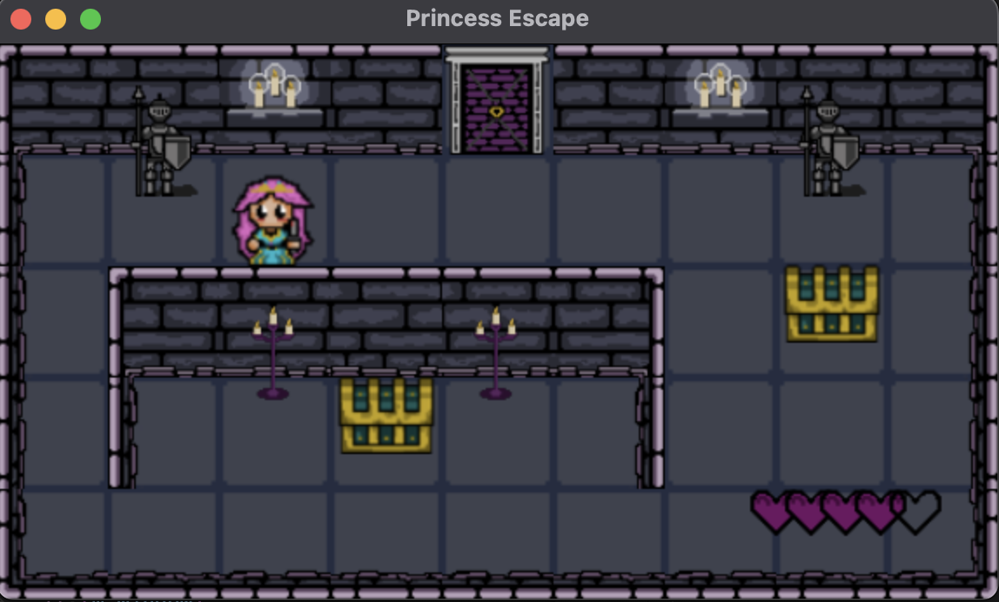

# 👑 Princess Escape

<p align="center">

</p>

> *A handcrafted 2D adventure game built in modern C++ with SDL3.*

---

# 📖 Story

## 📖 Story

One night, the princess awakens deep beneath an ancient castle with no memory of who she is or how she got there.

Its endless corridors are filled with abandoned chambers, hidden treasures, forgotten mechanisms, and strange creatures that attack her on sight, determined to keep her trapped.

The castle itself feels alive, constantly testing her resolve and drawing her deeper into its labyrinth.

To escape, she must explore every corner, collect useful items, unlock hidden passages, survive deadly encounters, and slowly recover fragments of her lost memories, piecing together the events that led her into this nightmare.

Every key found, every potion consumed, and every treasure chest opened could mean the difference between freedom... and becoming a forgotten soul, condemned to wander within the castle for eternity, with no memory of who she once was.

Little does she know that escaping the castle is only the beginning of a much greater journey... Beyond its walls await three mysterious realms, each bringing her closer to the truth behind her forgotten past.

---

# 🎮 Gameplay

Princess Escape is a top-down exploration game inspired by classic adventure games.

The player explores interconnected rooms, searches for hidden treasures, solves environmental puzzles, manages an inventory, and fights to survive while progressing deeper into the castle.

Throughout the adventure, the player will:

- 🗝️ Find keys to unlock new areas
- 📦 Discover hidden treasure chests
- ❤️ Collect potions to restore health
- 👾 Battle dangerous enemies
- 🚪 Unlock mysterious doors
- 🧩 Solve puzzles
- 🌍 Travel through different worlds, each hiding new dangers and secrets
- 💬 Talk to mysterious characters who may help—or deceive—you
- 🏰 Find a way to escape the cursed castle

---

# 🎥 Gameplay

> *(Gameplay GIF here)*

<p align="center">

</p>

---

# 🎨 Handmade Pixel Art

One of the goals of this project was to create **every visual asset from scratch**.

Every sprite, animation and object was **hand-drawn pixel by pixel using Piskel**.

No external sprite packs or asset libraries were used.

This includes:

- The Princess
- Enemies
- Treasure Chests
- Doors
- Potions
- Castle Decorations
- Environment Tiles
- User Interface Icons

## Sprite Showcase

| Princess | Chest |
|----------|-------|
|  |  |

| Enemy | Potion |
|-------|---------|
|  |  |

| Castle Decoration | Door |
|-------------------|------|
|  |  |

---

# 🏗️ Built From Scratch

Princess Escape was developed entirely in **Modern C++** using **SDL3**.

The project focuses on building a complete game architecture without relying on game engines.

Main systems include:

- Animation System
- Collision Detection
- Inventory Management
- Interactable Objects
- Enemy System
- Health System
- Resource Manager
- Tile Map Rendering
- UI System

---

# 📸 Screenshots

## Exploring the Castle


---

## Inventory


---

## Treasure Room


---

## Enemy Encounter


---

# 🛠 Technologies

- C++20
- SDL3
- SDL3_image
- SDL3_ttf
- CMake

---

# 🚀 Build

```bash
git clone https://github.com/Lyseron/PrincessEscape.git

cd PrincessEscape

mkdir build
cd build

cmake ..
make

./Princess_Escape
```

---

# 🌱 Future Plans

Princess Escape is still under development.

Planned features include:

- More enemy types
- Boss battles
- New castle areas
- Sound effects & music
- Save system
- NPC interactions
- More puzzles
- Controller support

---

# ❤️ A Personal Project

Princess Escape is much more than a programming exercise.

It is a personal project where I combine software engineering, game development and pixel art.

From the game architecture to every single sprite, everything has been created by myself as a way to improve my skills in C++, game design and software architecture.

I hope you enjoy exploring the castle as much as I enjoyed building it.
